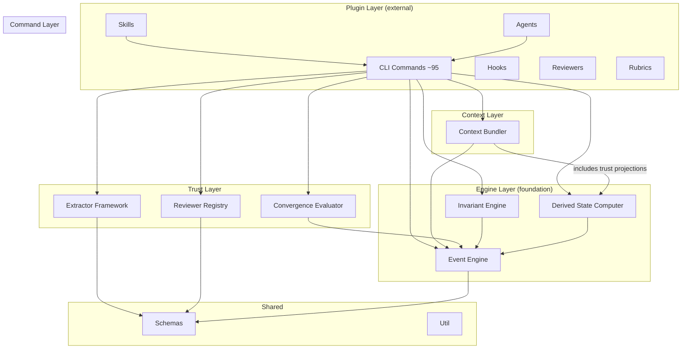

# Architecture Overview — goodplan v2

## System Architecture

goodplan v2 replaces the mutable-state-machine CLI with an event-sourced system organized into 4 layers with strict dependency direction, plus an external plugin layer.



## Dependency Rules

| Layer | May import | Must NOT import |
|---|---|---|
| `src/schemas/`, `src/util/` | Nothing (leaf) | Anything |
| `src/engine/` | `schemas`, `util` | `trust`, `context`, `commands` |
| `src/trust/` | `engine`, `schemas`, `util` | `context`, `commands` |
| `src/context/` | `engine`, `schemas`, `util` | `trust`, `commands` (trust data accessed via DerivedState projections — see [context.md](./context.md#trust-data-access)) |
| `src/commands/` | Everything in `src/` | Nothing restricted |
| `plugin/` | CLI commands only (via shell) | Never imports `src/` directly |

## Data Flow

1. **Skills** call CLI commands (never touch `.goodplan/` directly)
2. **CLI commands** validate input, call engine to append events
3. **Engine** checks invariants, writes JSONL, computes derived state
4. **Trust layer** reads event log for convergence evaluation, extraction, reviewer routing
5. **Context layer** reads derived state to assemble per-phase context bundles
6. **Hooks** protect integrity files (`events.jsonl`, spine files) from direct LLM writes

## Subsystem Map

### Engine Layer

| Subsystem | Location | Purpose | Maturity |
|---|---|---|---|
| Event Engine | `src/engine/events/` | Append-only JSONL writer/reader, envelope schema, prevId chain | experimental |
| Invariant Engine | `src/engine/invariants/` | Precondition checks before every event append (24 core rules) | experimental |
| Derived State Computer | `src/engine/derived-state/` | Stream events to compute current phase, blockers, next steps | experimental |

### Trust Layer

| Subsystem | Location | Purpose | Maturity |
|---|---|---|---|
| Convergence Evaluator | `src/trust/convergence/` | Rubric scoring, circuit breaker, convergence state machine | experimental |
| Extractor Framework | `src/trust/extractors/` | Parse embedded structured sections from artifacts (10 types) | experimental |
| Reviewer Registry | `src/trust/reviewers/` | YAML-fronted reviewer definitions, routing function | experimental |

### Context Layer

| Subsystem | Location | Purpose | Maturity |
|---|---|---|---|
| Context Bundler | `src/context/` | Per-phase bundle assembly with token budgeting | experimental |

### Command Layer

| Subsystem | Location | Purpose | Maturity |
|---|---|---|---|
| CLI Commands | `src/commands/` | ~95 citty commands organized by entity namespace | experimental |

### Plugin Layer

| Component | Location | Purpose |
|---|---|---|
| Skills | `plugin/skills/` | Orchestrator skills calling CLI commands |
| Agents | `plugin/agents/` | Phase, reviewer, editor, synthesis, completion agents |
| Reviewers | `plugin/reviewers/` | YAML-fronted reviewer definitions (moved from agents/_references/) |
| Rubrics | `plugin/rubrics/` | YAML rubric definitions |
| Hooks | `plugin/hooks/` | PreToolUse hooks protecting integrity files |

## Key Flows

### Epic Lifecycle (P1-P12)

```
P1 Epic-capture (collaborative)
  -> P2 Explore (collaborative)
  -> P3 Shape: architecture (collaborative)
  -> P4 Shape: pressure-test (autonomous)
  -> P5 Shape: slice set (autonomous + checkpoint)
  -> P6 Epic-activate (user approval)
  -> Per slice:
       P7 Slice-plan-draft (collaborative)
       -> P8 Plan-shape checkpoint (user approval)
       -> P9 Slice-plan-refine (autonomous)
       -> P10 Slice-implement (autonomous)
       -> P11 Slice-code-refine (autonomous)
       -> P12 Slice-land (mixed; final triggers epic completion)
```

### Refinement Loop (artifact-agnostic)

```
Draft artifact
  -> Dispatch reviewers (parallel, routed by registry)
  -> Score dimensions (per rubric)
  -> Synthesize feedback
  -> Evaluate convergence (CLI-computed)
  -> If CONTINUE: edit artifact, re-review
  -> If CONVERGED: commit artifact
  -> If CIRCUIT-BROKEN: surface to user with override option
```

### Event Append (every state change)

```
Command receives input
  -> Validate via Zod schema
  -> Build event envelope (id, schemaVersion, ts, scope, actor, domain, type, payload, prevId)
  -> Run invariant checks against current derived state
  -> If pass: append to events.jsonl
  -> If fail: return INVARIANT_FAILED error
```

## Cross-References

- Engine layer details: [engine.md](./engine.md)
- Trust layer details: [trust.md](./trust.md)
- Context layer details: [context.md](./context.md)
- Command layer details: [commands.md](./commands.md)
- Plugin architecture: [plugin.md](./plugin.md)
- Migration strategy: [migration.md](./migration.md)
- Full current-to-target mapping: [brainstorm/11-delta.md](../brainstorm/11-delta.md)
