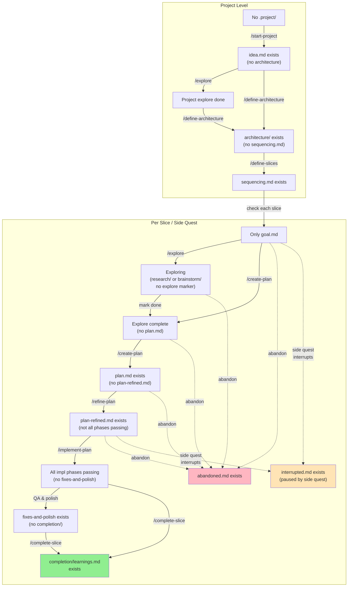
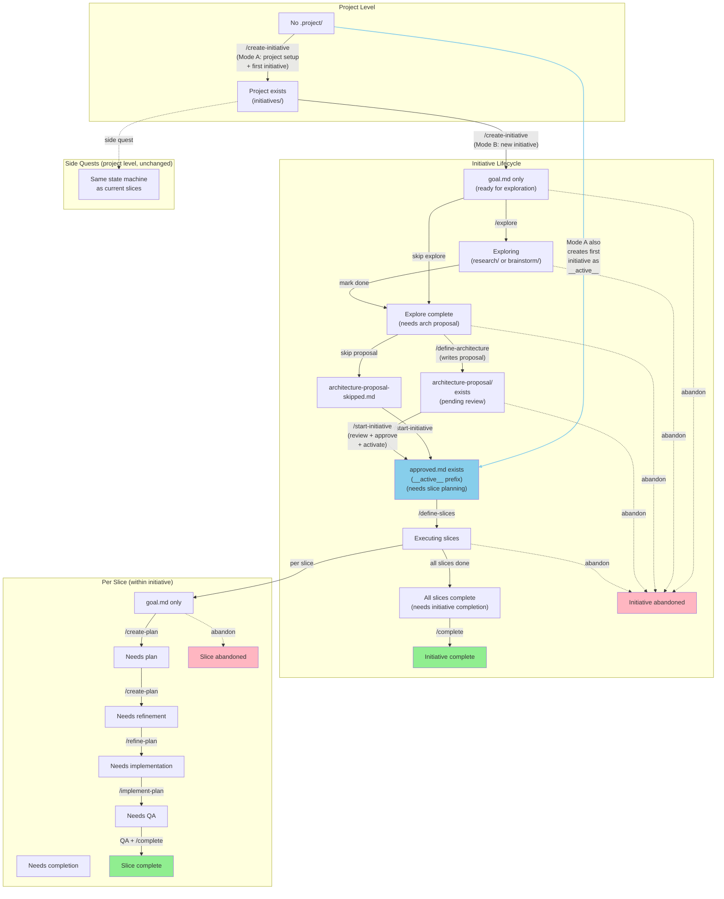

# State Machine Diagrams

## Current State Machine (Implemented)

Three levels: project → slice/quest. No initiative layer.



---

## Future State Machine (After Initiatives Infrastructure)

Three levels: project → initiative → slice. Side quests remain at project level.



### Key Differences

| Aspect | Current | Future |
|--------|---------|--------|
| **Entry point** | `/start-project` | `/create-initiative` (includes project setup) |
| **Activation gate** | None | `/start-initiative` (review proposal, approve, activate) |
| **Architecture location** | Top-level only | Two layers: initiative (target) + top-level (reality) |
| **Slice explore phase** | Per-slice explore | Initiative-level explore only |
| **Slice location** | `.project/vertical-slices/` | `initiatives/__active__<name>/vertical-slices/` |
| **Side quests** | Same state machine as slices | Unchanged — still at project level |
| **First initiative** | N/A | Auto-active, skips proposal/approval |
| **`__active__` prefix** | N/A | One active initiative at a time |
| **Stale detection** | None | `/create-plan` + `/refine-plan` check architecture freshness |

### First Initiative Shortcut

The first initiative skips several states because it IS the architecture (not a proposal):

```
/create-initiative (Mode A)
  → creates __active__initial/ (already active)
  → /explore (initiative-scoped)
  → /define-architecture (writes to initiative architecture/, top-level gets scaffold)
  → /define-slices (within initiative)
  → slice execution...
```

No `architecture-proposal/`, no `approved.md`, no `/start-initiative` needed.
